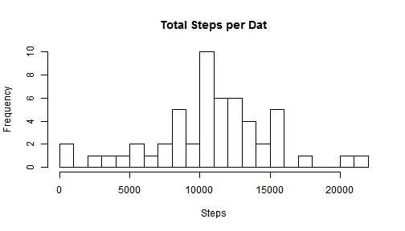
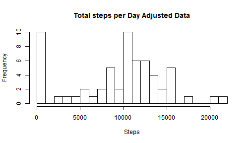
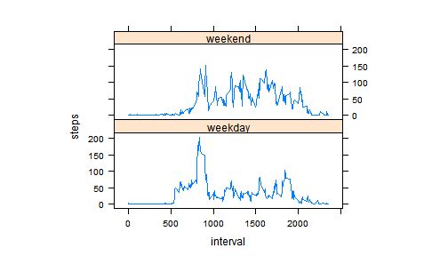

This is an R Markdown document. Markdown is a simple formatting syntax for authoring HTML, PDF, and MS Word documents. For more details on using R Markdown see <http://rmarkdown.rstudio.com>.

When you click the **Knit** button a document will be generated that includes both content as well as the output of any embedded R code chunks within the document. You can embed an R code chunk like this:


```r
library(knitr)
Sys.setlocale("LC_ALL", "English_United States.1252")
```

```
## [1] "LC_COLLATE=English_United States.1252;LC_CTYPE=English_United States.1252;LC_MONETARY=English_United States.1252;LC_NUMERIC=C;LC_TIME=English_United States.1252"
```

```r
opts_chunk$set(echo = TRUE)
```
##Read the data

```r
setwd("C:/Users/gahee/Documents/2016_Unist/2016_2nd/R/week14")
  rawdata <- read.csv("activity.csv")
dat=aggregate(steps ~date, data=rawdata, sum, na.rm=TRUE)
```

##histogram

```r
hist(dat$steps, breaks=20, main="Total Steps per Dat", xlab="Steps", ylab = "Frequency")
```



##what is mean total number of steps taken per day

```r
steps_mean = mean(rawdata$steps, na.rm=TRUE)
steps_median = median(rawdata$steps, na.rm = TRUE)

print(paste("The mean steps per day is: ", steps_mean))
```

```
## [1] "The mean steps per day is:  37.3825995807128"
```

```r
print(paste("The median steps per day is: ", steps_median))
```

```
## [1] "The median steps per day is:  0"
```
##what is the average daily activity pattern

```r
stepsdat = aggregate(steps ~ interval, data=rawdata,mean, na.rm=TRUE)
plot(stepsdat$interval, stepsdat$steps, type="l", main = "Average steps per Five minute interval", xlab="Interval No.", ylab="steps")
```


```r
maxsteps = max(stepsdat$steps)
print(paste("The maximum number of steps in a five minute interval was: ", maxsteps))
```

```
## [1] "The maximum number of steps in a five minute interval was:  206.169811320755"
```
##Imputing missing values

```r
missingdat = sum(is.na(rawdata$steps))
print(paste("There are", missingdat, "missing data points."))
```

```
## [1] "There are 2304 missing data points."
```

```r
betterdat = rawdata
betterdat$steps[is.na(betterdat$steps)] = median(rawdata$steps, na.rm = "TRUE")
betterdataday = aggregate(steps ~ date, data=betterdat, sum, na.rm=TRUE)
```

```r
hist(betterdataday$steps, breaks=20, main="Total steps per Day Adjusted Data", xlab="Steps", ylab="Frequency")
```



```r
bsteps_mean = mean(betterdat$steps)
bsteps_median = median(betterdat$steps)
print(paste("The mean is: ", bsteps_mean))
```

```
## [1] "The mean is:  32.4799635701275"
```

```r
print(paste("The median is: ", bsteps_median))
```

```
## [1] "The median is:  0"
```

##are there differences in activity patterns between weekdays and weekends

```r
betterdat$date = as.Date(betterdat$date)
betterdat$dayname = weekdays(betterdat$date)
betterdat$weekend = as.factor(ifelse(betterdat$dayname == "Saturday" | 
                                       betterdat$dayname == "Sunday", "weekend", "weekday"))
library(lattice)
```

```r
plotdat = aggregate(steps ~ interval + weekend, betterdat, mean)
xyplot(steps~interval | factor(weekend), data=plotdat, aspect = 1/3, type = "l")
```




Note that the `echo = FALSE` parameter was added to the code chunk to prevent printing of the R code that generated the plot.
